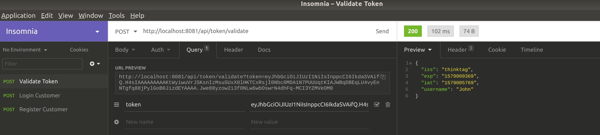

https://start.spring.io/

Spring Boot project to create and validate JWT tokens

## Create Token

HTTP POST

http://localhost:8081/api/token/create?username=John

Above call returns a JWT token for the username John

  

## Validate Token

To validate the above token use

HTTP POST

http://localhost:8081/api/token/validate?token=eyJhbGciOiJIUzI1NiIsInppcCI6IkdaSVAifQ.H4sIAAAAAAAAAKtWyiwuVrJSKsnIzMsuSUxX0lHKTCxRsjI0NbewNDIyMjPRUUqtKIAKmBiABUqLU4vyEnNTgfqy8jPylGoBbDA8zUYAAAA.XnjmWWaB9xSqG_lKJCL8Res1o5qeX1-1h2uYfPX82os

  

